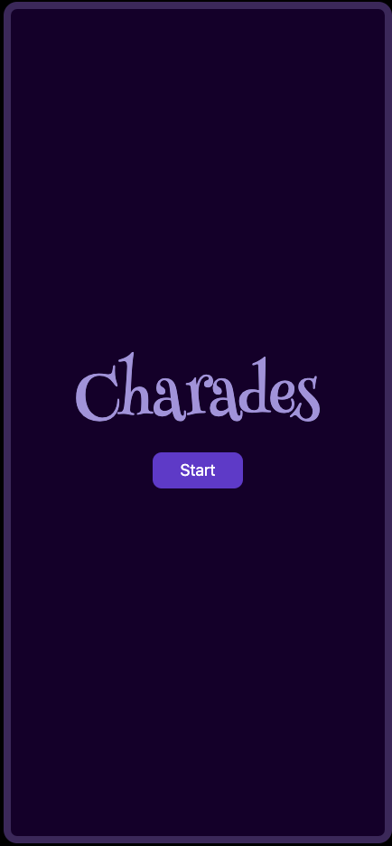
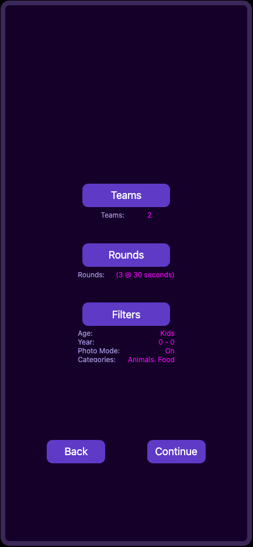
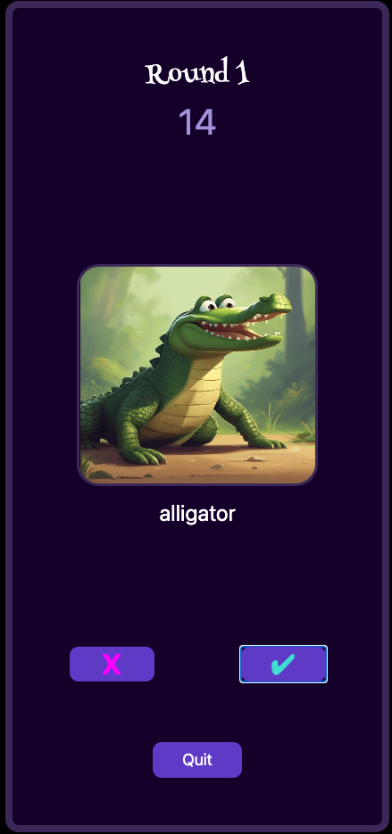
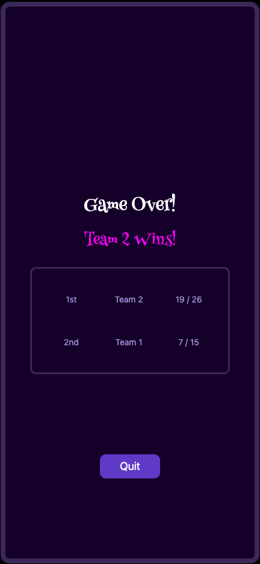

# Charades

### **Table of Contents**

1. [About](https://github.com/sdcramer/Charades/blob/main/README.md#h3-about)
2. [Built With](https://github.com/sdcramer/Charades/blob/main/README.md#h3-built-with)
3. [Usage](https://github.com/sdcramer/Charades/blob/main/README.md#h3-usage)
4. [Roadmap](https://github.com/sdcramer/Charades/blob/main/README.md#h3-roadmap)
5. [License](https://github.com/sdcramer/Charades/blob/main/README.md#h3-license)
6. [Contact](https://github.com/sdcramer/Charades/blob/main/README.md#h3-contact)

### **About**
This is a classic take on Charades. It is very much still in an MVP/Alpha version but future updates are in the works. The goal was to create a game that had a simple, straightforward UI, that captured the traditional feel of the game yet catered to all ages by offering some different game options and customizations.

Prior to development, Figma was used to create a wireframe mockup and database schema for the game. Each section of the game was broken down by its components. Each component was labeled, highlighted and grouped by color to help identify where generic/reusable components would be created to handle repeated patterns within the code (ie. buttons, input fields, selectors, menus, etc.). Relational database tables containing column names and primary and foreign keys were drawn up. Lines were then placed between tables as a means to visualize their relationships (one to one, one to many). These designs were done for a postgres database created in Supabase that is interacted with through a GraphQL API via Hasura. 

The overall aim of the design was to write clean, functional, and reusable components that leveraged local state management when feasible. 
Some of the bigger concepts to think through when coding was how to move through the different phases of the game, track game activity, and calculate score and rank.

Cycling through the different phases of the game was solved by conditionally rendering the different phases of the game based on the current string value of a global state variable called "gamePhase". This variable only accepted a subset of string values matching the different phases of the game predetermined through TypeScript. 

Game activity was tracked through the creation of a globally managed "gameState" object passed down via props. The direct access from object notation then made it easy to update the values stored on the object as game play unfolded.

Scoring was handled through functions tied to click events within the "missed" and "correct" buttons. Missed button incremented a total missed value and the correct button incremented a total score value for each team. These scores were stored on the "teams" object within "gameState". Ties were handled through a function which sorted then ran an if statement to determine whether scores were equal. Misses were then compared, the team with the fewest misses had one tenth of a point added to their overall score improving their ranking over the other team.

This is the first iteration of the game with future updates planned. If you would like to play the game, a demo is hosted on Netlify (see usage section below). 

Thanks for the interest! 

Cheers, 
~S

### **Built With**

### **Usage**

Demo: https://merry-crostata-62c6b8.netlify.app/

### **Roadmap**

- [ ] Add media queries for a responsive design
- [ ] Add a login screen
- [ ] Add additional categories/decks
- [ ] Publish

### **License**

Charades © 2022 by Sam Cramer is licensed under Attribution-NonCommercial-NoDerivatives 4.0 International. To view a copy of this license, visit http://creativecommons.org/licenses/by-nc-nd/4.0/

### **Contact**

Project Link: https://github.com/sdcramer/Charades
